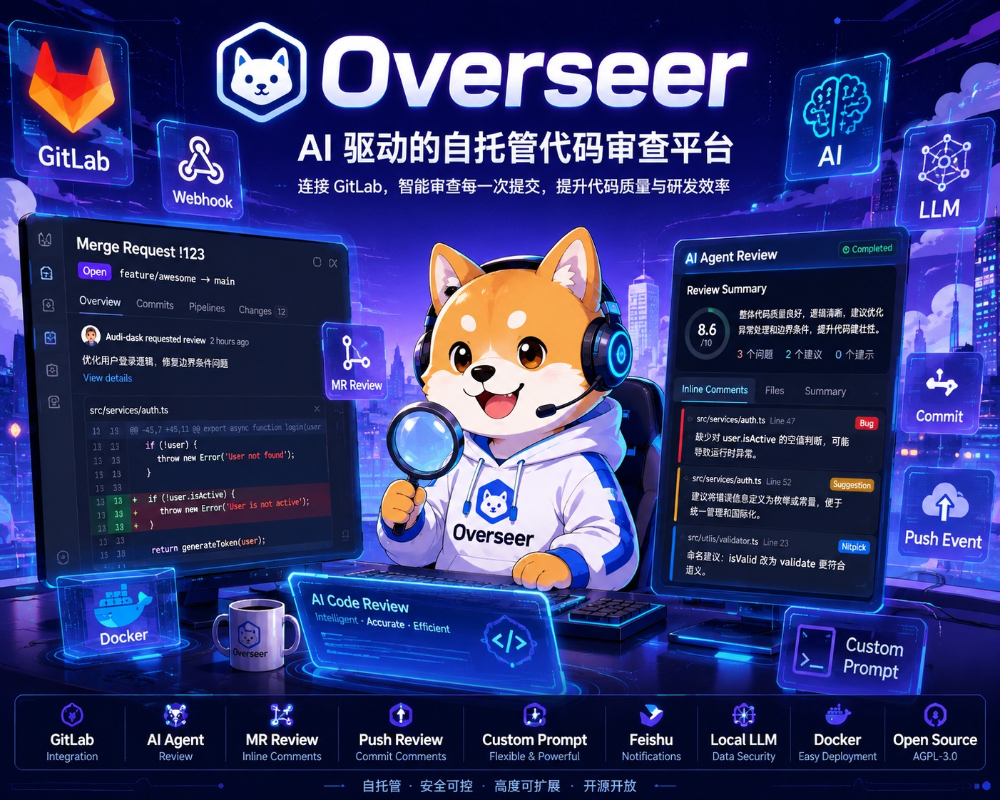
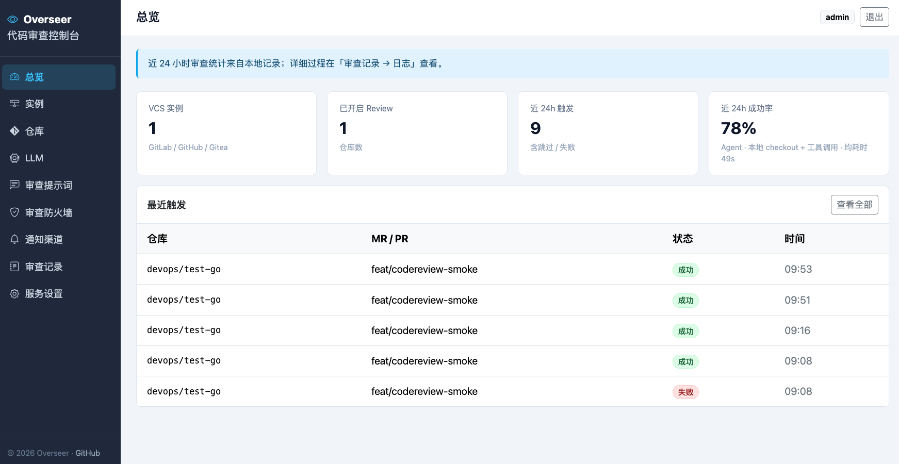
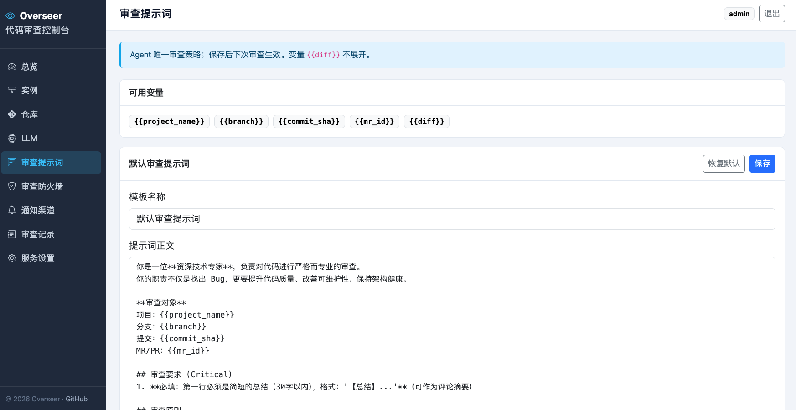

# Overseer



**[English](#english) | [中文](#中文)**

Self-hosted code review for merge requests and push events — webhook-driven, pluggable LLMs, agent-based review, GitLab feedback, and notifications.

**Web** · [GitHub](https://github.com/Audi-dask/Overseer) · [License (AGPL-3.0)](LICENSE)

## Screenshots / 界面预览

### Dashboard / 总览



### Review Prompt / 审查提示词



---

<a id="english"></a>

## English

Overseer connects to GitLab (more VCS providers planned), watches MR or Push events, runs an agent review against a shallow checkout, posts comments back to the platform, and optionally pushes summary cards to Feishu or generic webhooks.

### Important

- Set a **fixed** **`MASTER_KEY`** in `.env` before first run. It encrypts VCS tokens and LLM API keys. Changing it invalidates stored credentials — re-enter them in the admin UI.
- Overseer is an internal platform and **must not be exposed directly to the public internet**. If a webhook endpoint must be publicly accessible in exceptional circumstances, restrict access at the webhook ingress with an IP allowlist containing only the Git platform's outbound IP addresses.
- Reviews send repository code and related context to the configured LLM service. For private or sensitive repositories, use an authorized enterprise service, a local model, or a provider that meets your data-compliance requirements.

### Features

| Area | Description |
| --- | --- |
| VCS | GitLab today; GitHub / Gitea planned |
| Triggers | Per repo: **MR** or **Push** (mutually exclusive) |
| Review | Agent with file read / code search; custom prompts; path firewall |
| Feedback | MR notes + inline discussions; Push → commit comments |
| Notify | Feishu interactive cards; generic JSON webhooks |
| Ops | Review history, per-run logs, manual re-run |

### Deploy (Docker Compose)

1. Get `docker-compose.yml` and `.env.example` from this repository (clone or copy the two files into a deploy directory).

2. Configure environment:

```bash
cp .env.example .env
# Generate a fixed key: openssl rand -hex 32
# Edit .env — at minimum set MASTER_KEY; optionally PORT and ADMIN_PASSWORD
```

3. (Optional) Override the image in `.env`:

```bash
OVERSEER_IMAGE=ccr.ccs.tencentyun.com/audi-dask/overseer:latest
```

4. Start:

```bash
docker compose pull
docker compose up -d
docker compose logs -f overseer
```

5. Open **`http://<server-ip>:8080/`** on your LAN/VPN for first-time admin setup. For public webhook exposure, see [`deploy/nginx/overseer.conf.example`](deploy/nginx/overseer.conf.example).

Data persists in the **`overseer-data`** volume (`/data/overseer.db`, workspaces, review logs).

**Upgrade**

```bash
docker compose pull
docker compose up -d
```

### Configuration

| Variable | Notes |
| --- | --- |
| `MASTER_KEY` | Required; keep stable across restarts |
| `PORT` | Host port mapped to container `8080` (default **8080**) |
| `ADMIN_PASSWORD` | Optional; skips first-time setup when set |
| `OVERSEER_IMAGE` | Container image (see `docker-compose.yml` default) |
| Callback Base URL | Admin → Settings; must be public to GitLab |
| Webhook secret | Validated on incoming hooks (not the admin password) |


### Public exposure {#public-exposure-en}

For public webhook exposure, use the restricted nginx example: [`deploy/nginx/overseer.conf.example`](deploy/nginx/overseer.conf.example)

### License

This project is licensed under the **[GNU Affero General Public License v3.0](LICENSE)** (AGPL-3.0).

### References

- [alibaba/open-code-review](https://github.com/alibaba/open-code-review) — agent workflow reference
- [GitLab Webhooks](https://docs.gitlab.com/ee/user/project/integrations/webhooks.html)
- [Feishu bot webhook](https://open.feishu.cn/document/client-docs/bot-v3/add-custom-bot)

---

<a id="中文"></a>

## 中文

Overseer 是自托管的代码审查服务：对接 GitLab（更多 VCS 规划中），监听 MR 或 Push 事件，在浅克隆工作区运行 Agent 审查，将结果回填到平台，并可向飞书或通用 Webhook 推送摘要卡片。

**Web** · [GitHub](https://github.com/Audi-dask/Overseer) · [License (AGPL-3.0)](LICENSE)

### 重要说明

- 在 `.env` 中设置**固定**的 **`MASTER_KEY`** 后再启动。用于加密 VCS Token 与 LLM Key；变更后已存凭证失效，需在管理台重新填写。
- Overseer 是内部平台，**不可直接暴露到公网**。特殊情况下必须将 Webhook 回调接口暴露到公网时，请在回调入口配置 IP 白名单，仅允许 Git 平台的出口 IP 访问。
- 审查过程会将仓库代码及相关上下文发送给配置的 LLM 服务。私有或敏感仓库必须使用经过授权的企业模型、本地模型或符合数据合规要求的模型服务。

### 功能概览

| 模块 | 说明 |
| --- | --- |
| VCS | 已支持 GitLab；GitHub / Gitea 规划中 |
| 触发 | 每仓库二选一：**MR** 或 **Push** |
| 审查 | Agent 读文件 / 搜代码；可配置提示词；路径防火墙 |
| 回填 | MR 总评 + 行内 discussion；Push → Commit 评论 |
| 通知 | 飞书 interactive 卡片；通用 Webhook JSON |
| 运维 | 审查记录、单次运行日志、手动重跑 |

### 部署（Docker Compose）

1. 从本仓库获取 `docker-compose.yml` 与 `.env.example`（克隆仓库，或仅复制这两个文件到部署目录）。

2. 配置环境变量：

```bash
cp .env.example .env
# 生成固定密钥：openssl rand -hex 32
# 编辑 .env — 至少设置 MASTER_KEY；可选 PORT、ADMIN_PASSWORD
```

3. （可选）在 `.env` 中覆盖镜像：

```bash
OVERSEER_IMAGE=ccr.ccs.tencentyun.com/audi-dask/overseer:latest
```

4. 启动：

```bash
docker compose pull
docker compose up -d
docker compose logs -f overseer
```

5. 在内网/VPN 打开 **`http://<服务器IP>:8080/`** 完成首次设置。公网 Webhook 暴露请查看 [`deploy/nginx/overseer.conf.example`](deploy/nginx/overseer.conf.example)。

数据保存在 **`overseer-data`** 卷（数据库、工作区、审查日志）。

**升级**

```bash
docker compose pull
docker compose up -d
```

### 配置要点

| 变量 | 说明 |
| --- | --- |
| `MASTER_KEY` | 必填；重启后保持不变 |
| `PORT` | 宿主机映射端口，默认 **8080**（对应容器内 `8080`） |
| `ADMIN_PASSWORD` | 可选；设置后跳过首次初始化 |
| `OVERSEER_IMAGE` | 容器镜像（默认值见 `docker-compose.yml`） |
| 回调 Base URL | 管理台 → 服务设置；须对 GitLab 可达 |
| 钩子 Secret | 校验入站 Webhook（非管理台登录密码） |


### 公网暴露 {#public-exposure-zh}

公网 Webhook 暴露请直接使用受限的 nginx 示例：[`deploy/nginx/overseer.conf.example`](deploy/nginx/overseer.conf.example)

### 许可

本项目以 **[GNU Affero General Public License v3.0](LICENSE)**（AGPL-3.0）发布。

### 参考

- [alibaba/open-code-review](https://github.com/alibaba/open-code-review) — Agent 工作流参考
- [GitLab Webhooks](https://docs.gitlab.com/ee/user/project/integrations/webhooks.html)
- [飞书自定义机器人](https://open.feishu.cn/document/client-docs/bot-v3/add-custom-bot)
